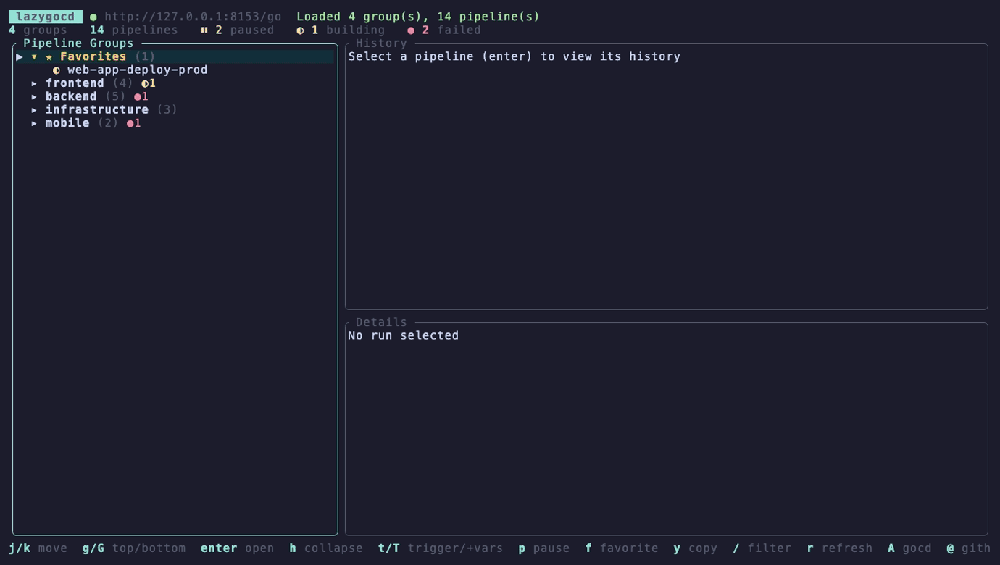
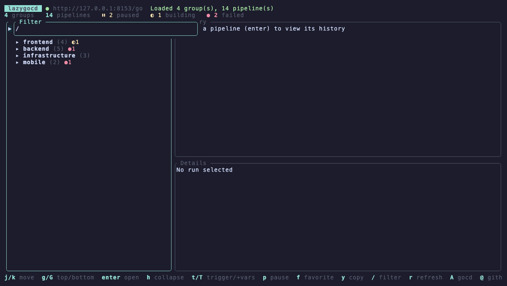
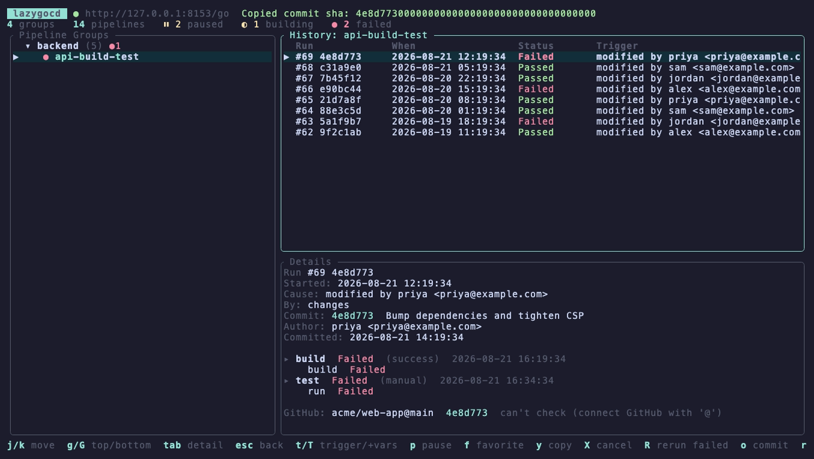
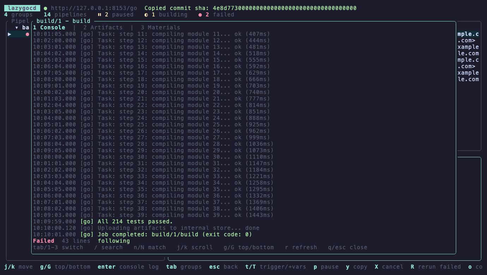
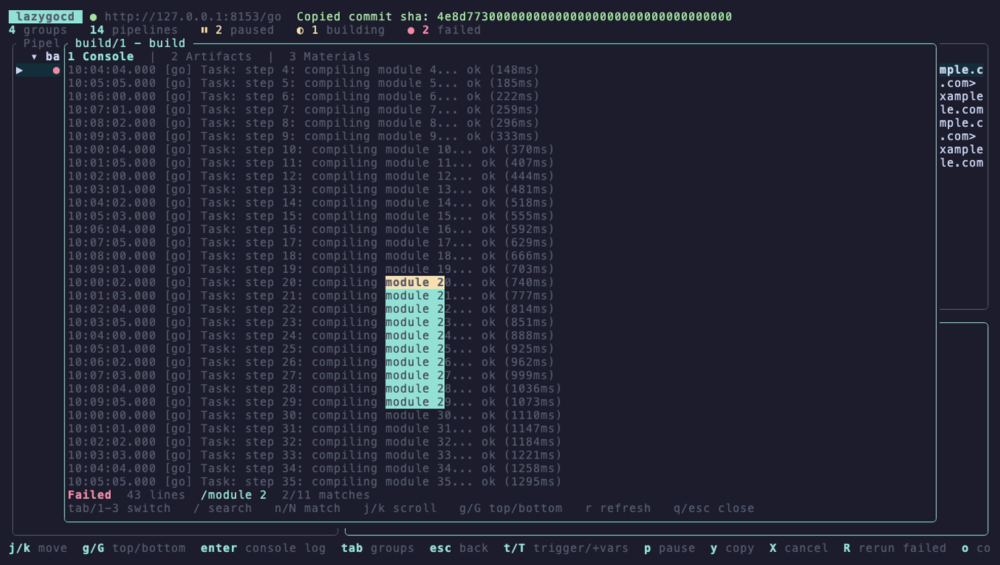
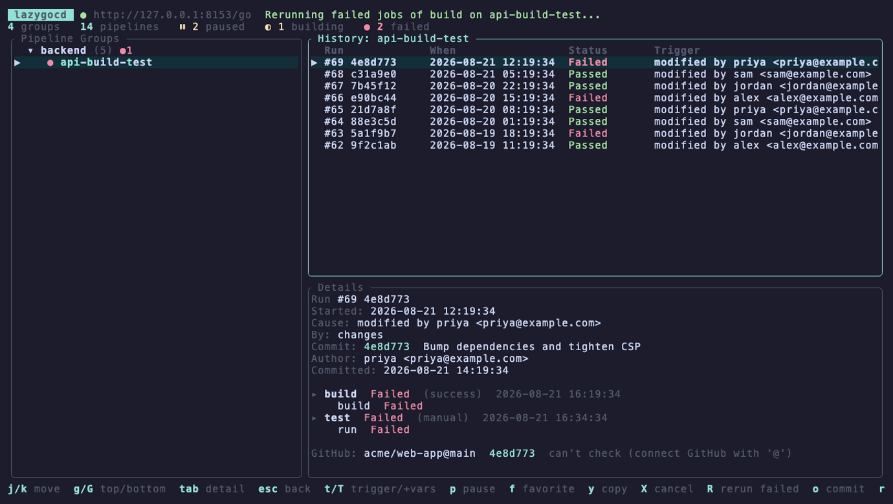

<div align="center">

# lazygocd

**A fast, keyboard-driven terminal UI for [GoCD](https://www.gocd.org/) pipelines.**

[](https://github.com/Sahilll15/lazygocd/releases)
[](https://crates.io/crates/lazygocd)
[](LICENSE)
[](https://www.rust-lang.org/)

[Documentation](https://lazygocd.vercel.app) · [Installation](#installation) · [Keybindings](#keybindings) · [Configuration](#configuration)

</div>

---

Browse every pipeline group, drill into run history and stage/job details, tail live console logs, and trigger/pause/cancel builds — without leaving your terminal or waiting on the GoCD web UI.



### Try it without a GoCD server

```sh
lazygocd --demo
```

Launches the full interface against fictional pipelines. No server, no
credentials, no config file written. Every key works, and the mutating ones
are no-ops.

## Why

GoCD's web dashboard gets slow and clicky on large installations. lazygocd loads an entire 2,000+ pipeline instance in one request, caches it locally so the next launch is instant, and puts every common action one keystroke away.

## Features

- **Three-pane layout** — pipeline groups tree, run history, and stage/job details, `tab`/`esc` to move between them, full mouse support
- **Act on pipelines** — trigger runs (`t`), trigger with one-off environment variables (`T`), pause/unpause (`p`), cancel a running stage (`X`), rerun the failed jobs of a failed stage (`R`, or the whole stage), all with confirmation
- **Live console logs** — auto-tail while the job runs, `/` search, and severity coloring (failures red, warnings yellow, successes green, agent chatter dimmed) so long logs actually scan
- **Fuzzy filter** — `/` then a few characters (`wabp` matches `web-app-build-prod`), matched letters highlighted
- **Favorites** — star pipelines with `f`; they pin to a ★ section at the top
- **Endless history** — reaching the bottom of the history pane loads older runs automatically, page by page
- **Stale-deploy detection** — compares each deployed commit against the branch head and flags `⚠ not latest`, one check per git material when a pipeline has several; uses your `gh` CLI token automatically, and `o` jumps to the commit or pending diff on GitHub. GitHub Enterprise works too (`github_api_base`)
- **Failure notifications** — a desktop notification when a favorited pipeline's latest run turns red (macOS/Linux, `notifications = false` to opt out)
- **Feels instant** — disk-cached dashboard renders before the network responds, history prefetches on hover, adaptive rendering idles at ~0% CPU
- **Network-resilient** — cached data stays browsable through VPN drops; reconnect anytime with `A`

## Installation

### Homebrew (macOS/Linux)

```sh
brew install Sahilll15/tap/lazygocd
```

### Cargo

```sh
cargo install lazygocd
```

Or track the latest commit rather than the last release:

```sh
cargo install --git https://github.com/Sahilll15/lazygocd
```

### Binary releases

Prebuilt binaries for macOS (Apple Silicon and Intel) and Linux x86_64 are on the [releases page](https://github.com/Sahilll15/lazygocd/releases):

```sh
tar xzf lazygocd-*.tar.gz
mv lazygocd /usr/local/bin/
```

### From source

```sh
git clone https://github.com/Sahilll15/lazygocd
cd lazygocd
cargo build --release
# binary at target/release/lazygocd
```

## Getting started

Run `lazygocd` (`--help` for flags; `--config-dir` overrides the config location, and `$XDG_CONFIG_HOME` is respected). Shell completions and a man page ship built in:

```sh
lazygocd completions zsh > ~/.zfunc/_lazygocd
lazygocd man > /usr/local/share/man/man1/lazygocd.1
```

Run `lazygocd`. On first launch it walks you through connecting inside the TUI itself: server URL (e.g. `https://gocd.example.com/go`), then username/password or a personal access token (recommended), then a TLS choice. The config is saved to `~/.config/lazygocd/config.toml` (mode `0600`) and you land straight in the dashboard. Press `A` anytime to reconnect or switch servers.

Env vars override the config for scripting: `GOCD_URL`, `GOCD_USERNAME`, `GOCD_PASSWORD`, `GOCD_TOKEN`, `GOCD_INSECURE=1`, `GITHUB_TOKEN`.

## Keybindings

| Key | Action |
|---|---|
| `j`/`k`, `↓`/`↑` | move selection |
| `g`/`G` | jump to top / bottom of the focused list |
| `ctrl-d`/`ctrl-u`, `pgdn`/`pgup` | half-page down / up |
| `l`/`enter`/`→` | expand group / open pipeline / open a job (console, artifacts, materials tabs) |
| `h`/`←` | collapse group |
| `tab` | cycle focus: groups → history → details |
| `esc` | back: details → history → groups; in groups, clear the filter |
| `t` | trigger a new run (confirm) |
| `T` | trigger with environment variables — type `NAME=VALUE` entries, an empty entry finishes |
| `p` | pause/unpause (confirm) |
| `f` | star/unstar as favorite |
| `v` | switch personalized dashboard view (your GoCD web-UI tabs) |
| `V` | save the current filter matches as a new GoCD view |
| `y` | copy: commit SHA (history/details), pipeline/group name (tree), artifact URL (job view) |
| `e` | open the current log in `$VISUAL` / `$EDITOR` (vim, nvim, code, zed) |
| `X` | cancel the currently running stage (confirm) |
| `R` | rerun the failed jobs of the selected run's failed stage (`a` in the confirm reruns the whole stage) |
| `o` | open the selected run's commit on GitHub (or the pending diff when the deploy is behind) |
| `/` | fuzzy-filter pipelines |
| `r` | refresh |
| `A` | connect / reconnect GoCD |
| `@` | set a GitHub token (optional: `gh auth token` is picked up automatically if the GitHub CLI is signed in) |
| `?` | help |
| `q` / `ctrl-c` | quit |

Mouse: click focuses a pane and selects a row, click again to open, scroll wheel scrolls the pane under the cursor.

In the job view: `tab`/`1`-`3` switch between Console, Artifacts, and Materials tabs; `/` searches the log with `n`/`N` to jump between matches; `j`/`k` scroll, `g`/`G` top/bottom (`G` resumes auto-follow), `r` refresh, `q`/`esc` close. On the Artifacts tab, `enter` opens the selected file in your browser.

## Configuration

`~/.config/lazygocd/config.toml`:

```toml
server_url = "https://gocd.example.com/go"
auth_token = "..."            # or username + password
insecure_skip_verify = false  # true only for self-signed certs
poll_interval_secs = 30       # background auto-refresh cadence
github_token = "..."          # optional; `gh auth token` is used automatically if unset
github_api_base = "https://api.github.com"  # GitHub Enterprise: point this at your GHE /api/v3
notifications = true          # desktop notification when a favorited pipeline turns red
```

Git materials on any host (`git@HOST:owner/repo.git` or `https://HOST/owner/repo`) are recognized; `o` opens commits on that host, and the stale-deploy check always queries `github_api_base` — for repos on a GitHub Enterprise instance, set it to `https://ghe.example.com/api/v3`.

The dashboard cache lives at `~/.config/lazygocd/dashboard_cache.json` and favorites at `~/.config/lazygocd/favorites.json`; both are safe to delete.

## How it stays fast

- The whole dashboard (groups, pipelines, pause state, latest-run status) loads in **one gzip'd request** — measured at ~2s for a large / 2,389-pipeline production instance
- The last successful load is cached to disk, so every launch after the first renders **immediately** while a refresh runs behind it
- Opening a pipeline you've viewed before is instant (in-memory cache), and resting the cursor on a row for 300ms **prefetches** its history
- Steady-state polls cost almost nothing: the dashboard revalidates with **ETag/304**, and console tailing fetches **only new lines** (`startLineNumber`)
- The render loop only draws when something changed — **~0% CPU** while idle
- A dead route (VPN drop) fails in seconds, not minutes, and never blocks the UI

## Screenshots

| Dashboard | Run history and details |
|---|---|
|  |  |

<details>
<summary>More screenshots: live console logs, log search, rerunning failed jobs</summary>





</details>

## Compatibility

Tested against GoCD 23.5.0. Uses the stable v1/v3/v4 JSON APIs plus the console-log file endpoint, so nearby versions should work fine. macOS and Linux; any terminal with 256-color support.

## License

[MIT](LICENSE)
